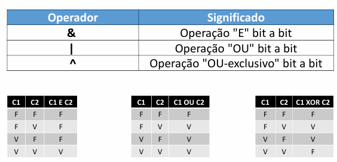
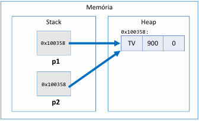

# Java - Conceitos Basicos

## Introdução ao Java

### JVM - Java Virtual Machine

Maquina Virtual do Java (JVM) é uma máquina virtual que permite que computadores executem programas Java, alem de permitir desenvolver os aplicativos em Java.

package = agrupamento lógico de classes e interfaces relacionadas.
modulo = agrupamento lógico de pacotes relacionados.
runtime = agrupamento físico (arquivos).
aplicação = conjunto de módulos relacionados.

## Codigos Java Basicos

sysout = atalho para System.out.print

Exemplo de código Java:
`System.out.print("Olá mundo!");`
Codiigo para imprimir algo no console.

`System.out.println("Olá mundo!");`
Codiigo para imprimir algo no console e o "ln" faz com que tenha quebra de linha.

Exemplo de formatação de números:

```Java
 double x = 10.35784;
 System.out.println(x);
 System.out.printf("%.2f%n", x);
 System.out.printf("%.4f%n", x);
 Locales.setDefault(Locale.US);
 System.out.printf("%.4f%n", x);
```

### Casting

Caso eu tenha duas variaveis de numeros inteiros e eu queira fazer uma divisão entre elas, o resultado será um número inteiro, mesmo que o resultado da divisão seja um número decimal. Para resolver isso, eu posso fazer um "casting" de uma das variaveis para double, assim o resultado será um número decimal.

```Java
 int a, b;
 a = 5;
 b = 2;
 double resultado = (double) a / b;
 System.out.println(resultado);
```

O casting seria como se fosse o parse no C#.

### Entrada de Dados

Para ler dados do usuário em Java, utilizamos a classe Scanner.

```Java
import java.util.Scanner;
public class Main {
	public static void main(String[] args) {
		Scanner sc = new Scanner(System.in);
		String x;
		x = sc.next();
		System.out.println("Você digitou: " + x);
		sc.close();
	}
}
```

Para ler do tipo int:

```Java
int x;
x = sc.nextInt();
```

Para ler do tipo double:

```Java
double x;
		x = sc.nextDouble();
```

Para ler dados da linha inteira :

```Java
string x;
		x = sc.nextLine();
```

### Operações Matemáticas

Math.sqrt = raiz quadrada
Math.pow = potência
Math.abs = valor absoluto

## Debug

Debug é o processo de encontrar e corrigir erros no código. O processo de debug depende da IDE que você está utilizando. Vou explicar como fazer debug no IntelliJ e no Eclipse.

### Debug no IntelliJ

1. Coloque um breakpoint clicando na margem esquerda da linha onde você quer parar a execução
2. Clique no icone de debug (um bug) ou pressione Shift + F9
3. A execução do programa irá parar no breakpoint
4. Se você quiser indo avançando ao longo do codigo linha por linha, pressione F10 (Step Over)

### Debug no Eclipse

1. Coloque um toggle breakpoint clicando na margem esquerda da linha onde você quer parar a execução
2. Clique no arquivo -> Debug As -> Java Application ou pressione F11
3. A execução do programa irá parar no breakpoint
4. Se você quiser indo avançando ao longo do codigo linha por linha, pressione F6(Step Over)

## Codigos de Java

### Estrutura Repetitiva - do While

Bloco de comandos executa pelo menos uma vez, pois a condição é verificada no final.

```Java
 do {
//bloco de comandos
 } while(condição);
```

## Convenções de Nomenclatura em Java

### CamelCase: lastName

pacotes
atributos
métodos
variáveis e parâmetros

### Pascal Case: ProductService

classes

## Bitwise

Operadores bit a bit operam diretamente nos bits dos números inteiros.


## Funções Strings

1. Formatar: toLowerCase(), toUpperCase(), trim()
2. Recortar: substring(inicio), substring(inicio, fim)
3. Substituir: Replace(char, char), Replace(string, string)
4. Buscar: IndexOf, LastIndexOf
5. str.Split(" ")

### Split

```Java
 String s = "potato apple lemon";
String[] vect = s.split(" ");
String word1 = vect[0];
String word2 = vect[1];
String word3 = vect[2]
```

## Funções

As funções do Java são criadas embaixo da public static void main(String[] args) {}

## Classes e Instanciação de Objeto

Na pasta entities é criada a classe com os atributos e métodos. Na pasta application é onde o programa principal é executado.

```Java
package entities;

public class Triangle {
		public double a;
		public double b;
		public double c;
}
```

```Java
package application;

import entities.Triangle;
				Triangle x, y;
				x = new Triangle();
				y = new Triangle();
```

## Constantes

Constantes são variáveis que não podem ter seu valor alterado durante a execução do programa. Em Java, as constantes são declaradas utilizando a palavra-chave `final` e geralmente são escritas em letras maiúsculas com palavras separadas por underscores `_`.

```Java
public static final double PI = 3.14159;
```

## Metodos Estáticos

Métodos estáticos pertencem à classe em si, e não a uma instância específica da classe. Eles podem ser chamados sem a necessidade de criar um objeto da classe.

Ou seja, são funções que estão no mesmo arquivo da classe principal e podem ser chamadas diretamente.

```Java
 public class Program {
	public static final double PI= 3.14159;

	public static void main (String[] args) {
		double c = circumference(radius);
		double v = volume(radius);
	}

	public static double circumference(double radius) {
		return 2.0 * PI * radius;
	}

	public static double volume(double radius) {
		return 4.0 * PI * radius * radius * radius / 3.0;
	}
 }
```

Tambem é possível chamar métodos estáticos de outras classes, mas diferente de metodos de instância, não é necessário criar um objeto da classe para chamar o método estático.

```Java
 double result = Calculator.volume(25.0);
```

## Construtores

Construtores são métodos especiais usados para inicializar objetos de uma classe. Eles têm o mesmo nome da classe.

```Java
public class Product {

    public String name;
    public double price;
    public int quantity;

    public Product(String name, double price, int quantity) {
        this.name = name;
        this.price = price;
        this.quantity = quantity;
    }
}
```

## Sobrecarga de Construtores

A sobrecarga de construtores permite que uma classe tenha múltiplos construtores com diferentes listas de parâmetros. Isso possibilita a criação de objetos de maneiras diferentes, dependendo dos dados disponíveis no momento da instânciação.
Tambem podemos ter um construtor padrão (sem parâmetros).

## Encapsulamento

Encapsulamento é a restrição do acesso direto aos dados de um objeto, tendo que utilizar métodos específicos para acessar e modificar esses dados (getters e setters).
Primeiro temos que definir os atributos como private e depois criar os métodos `get` e `set`.

```Java
public class Product {
		private String name;
 
		public String getName() {
				return name;
		}

		public void setName(String name) {
				this.name = name;
		}
}
```

## Gerando Construtores, Getters e Setters Automaticamente no IntelliJ

1. Clique com o botão direito dentro da classe onde você deseja gerar o construtor, getters e setters.
2. Selecione "Generate..." ou pressione `Alt + Insert`.
3. Escolha "Constructor" para gerar o construtor, "Getter" para gerar os getters, ou "Setter" para gerar os setters.
4. Selecione os atributos que você deseja incluir e clique em "OK".

## Modificadores de Acesso

private = acessível apenas dentro da própria classe.
(nada) = acessível dentro do mesmo pacote.
protected = acessível dentro do mesmo pacote e em subclasses.
public = acessível de qualquer lugar.

## Classes não tem valor

Variaveis do tipo classe armazenam referências para objetos na memória, e não os próprios objetos.



## Vetores

### Arranjo (array) é uma estrutura de dados

Homogênea (dados do mesmo tipo)
Ordenada (elementos acessados por meio de posições)
 Alocada de uma vez só, em um bloco contíguo de memória

### Vantagens

 Acesso imediato aos elementos pela sua posição

### Desvantagens

 Tamanho fixo
 Dificuldade para se realizar inserções e deleções.

### Estrutura de criação de um vetor

```Java
tipo[] nomeDoVetor = new tipo[tamanho];
```

```Java
double[] nomeDoVetor = new double[10];
```

### Inserindo valores em um vetor

No exemplo abaixo, o usuário informa o tamanho do vetor e depois insere os valores, utilizando de um `for` para percorrer o vetor e inserir os valores.

```Java
int n =sc.nextInt();
double[] vect = new double[n];  
  for (int i=0; i<n; i++){
    vect[i] = sc.nextDouble();
  }
```

### Criação de um vetor numa classe

```Java
public class Product {

    private String name;
    private double price;
}
```

```Java
        Locale.setDefault(Locale.US);
        Scanner sc = new Scanner(System.in);

        int n = sc.nextInt();
        Product[] vect = new Product[n];

        for (int i = 0; i < vect.length; i++){
            sc.nextLine();
            String name = sc.nextLine();
            double price = sc.nextDouble();
            vect[i] = new Product(price, name);
        }
```

### Boxing e Unboxing

Boxing é o processo de converter um tipo primitivo em um objeto do tipo referência correspondente. Unboxing é o processo inverso, onde um objeto do tipo referência é convertido de volta para um tipo primitivo.

```Java
int x = 10; // tipo primitivo
Object obj = x; // Boxing
int y = (int) obj; // Unboxing
```

### Wrappers

Wrappers são classes que encapsulam tipos primitivos em objetos. Cada tipo primitivo em Java tem uma classe wrapper correspondente. Assim, não é preciso fazer boxing e unboxing manualmente, pois o Java faz isso automaticamente.
A vantagem de usar wrappers é que eles permitem que sejam nulos.

| Tipo Primitivo | Classe Wrapper |
|----------------|----------------|
| int            | Integer        |
| double         | Double         |
| boolean        | Boolean        |
| char           | Character      |
| long           | Long           |
| float          | Float          |
| byte           | Byte           |
| short          | Short          |

```Java
int x = 10; // tipo primitivo
Interger obj = x; // Boxing
int y = obj; // Unboxing
```

## Laços For Each

O laço for each é uma forma simplificada de percorrer elementos em arrays ou coleções.

```Java
for (tipo item : coleção) {
		// bloco de comandos
}
```

```Java
String[] vect = new String[] {"Ana", "Bruno", "Carlos"};
for (String nome : vect) {
		System.out.println(nome);
}
```

## Listas

### Lista é uma estrutura de dados

• Homogênea (dados do mesmo tipo)
• Ordenada (elementos acessados por meio de posições)
• Inicia vazia, e seus elementos são alocados sob demanda
• Cada elemento ocupa um "nó" (ou nodo) da lista

• Tipo (interface): List
• Classes que implementam: ArrayList, LinkedList, etc.

### Vantagens

• Tamanho variável
• Facilidade para se realizar inserções e deleções

### Desvantagens

• Acesso sequencial aos elementos*.

### Estrutura de criação de uma lista

```Java
List<tipo> nomeDaLista = new ArrayList<>();
```

### Comandos básicos para listas

```Java
nomeDaLista.add(elemento); // Adiciona um elemento no final da lista
nomeDaLista.add(indice, elemento); // Adiciona um elemento em uma posição específica
nomeDaLista.size(); // Retorna o tamanho da lista
nomeDaLista.remove(indice); // Remove o elemento de uma posição específica
nomeDaLista.remove(elemento); // Remove a primeira ocorrência do elemento
nomeDaLista.removeIf(x -> condição); // Remove todos os elementos que satisfazem a condição
nomeDaLista.indexOf(elemento); // Retorna o índice da primeira ocorrência do elemento
List<tipo> subLista = nomeDaLista.stream().filter(x -> condição).collect(Collectors.toList()); // Cria uma sublista com elementos que satisfazem a condição
```

## Matriz 
Em programação, "matriz" é o nome dado a arranjos bidimensionais

### Arranjo (array) é uma estrutura de dados

• Homogênea (dados do mesmo tipo)
• Ordenada (elementos acessados por meio de posições)
• Alocada de uma vez só, em um bloco contíguo de memória

### Vantagens

• Acesso imediato aos elementos pela sua posição

### Desvantagens

• Tamanho fixo
• Dificuldade para se realizar inserções e deleções

### Estrutura de criação de uma matriz

```Java
// Bidimensional
tipo[][] nomeDaMatriz = new tipo[linhas][colunas];

// Tridimensional
tipo[][][] nomeDaMatriz = new tipo[linhas][colunas]; 
```

## Datas e Horas

### Data-[hora] local

ano-mês-dia-[hora] sem fuso horário
[hora] opcional

### Data-hora global

ano-mês-dia-hora com fuso horário

### Duração

tempo decorrido entre duas data-hora.

## Definição de Data-Hora

```Java
LocalDate d01 = LocalDate.now(); // Data atual
LocalDateTime d02 = LocalDateTime.now(); // Data e hora atual
Instant d03 = Instant.now(); // Data e hora atual em UTC

LocalDate d04 = LocalDate.parse("2024-06-25"); // Data a partir de uma string
LocalDateTime d05 = LocalDateTime.parse("2024-06-25T15:30:45"); // Data e hora a partir de uma string
Instant d06 = Instant.parse("2024-06-25T15:30:45Z"); // Data e hora em UTC a partir de uma string
Instant d06 = Instant.parse("2024-06-25T15:30:45-03:00"); // Data e hora em UTC a partir de uma string no fuso de São Paulo
```

### Formatação de Data-Hora

[Documentação do DateTimeFormatter](https://docs.oracle.com/javase/8/docs/api/java/time/format/DateTimeFormatter.html)

```Java
DateTimeFormatter fmt1 = DateTimeFormatter.ofPattern("dd/MM/yyyy");
LocalDate d04 = LocalDate.parse("25/06/2024", fmt1); // Data a partir de uma string num formato específico
```

### Formatação de Data-Hora para saída

```Java
DateTimeFormatter fmt2 = DateTimeFormatter.ofPattern("dd/MM/yyyy");
DateTimeFormatter fmt3 = DateTimeFormatter.ofPattern("dd/MM/yyyy").withLocale(ZoneId.systemDefault()); // Formatação de data para string com localidade
DateTimeFormatter fmt4 = DateTimeFormatter.ISO_DATE;
 // Formatação de data e hora para string
String s1 = d04.format(fmt2); // Formatação de data para string
System.out.println(d04.format(fmt3)); // Formatação de data para string
String s1 = d04.format(fmt4); // Formatação de data para string
// ou
String s2 = fmt2.format(d04); // Formatação de data para string

LocalDate r2 = LocalDate.ofInstant(d06, ZoneId.of("Portugal")); // Converter Instant para LocalDate no fuso local
d04.getDayOfMonth(); // Obter o dia do mês
d04.getMonthValue(); // Obter o mês
d04.getYear(); // Obter o ano
d04.getHour(); // Obter a hora
d04.getMinute(); // Obter os minutos

```

### Operações com Data-Hora

```Java
d04.plusDays(7); // Adicionar 7 dias
d04.plusMonths(6); // Adicionar 6 meses

d04.minusDays(7); // Subtrair 7 dias
d04.minusMonths(6); // Subtrair 6 meses
d04.until(d07, ChronoUnit.DAYS); // Diferença em dias entre d04 e d07
Duration.between(d06, d08).toDays(); // Diferença em dias entre
Duration.between(d06, d08).toHours(); // Diferença em horas entre
Duration.between(d06, d08).toMinutes(); // Diferença em minutos entre

Duration t1 = Duration.between(d06.atTime(0, 0), d08.atTime(0, 0)); // Diferença entre duas datas
Duration t1 = Duration.between(d06.atStartOfDay(), d08.atStartOfDay()); // Diferença entre duas datas
sout.println("Diferença em dias: " + t1.toDays());
```

## Enumerações

[Documentação sobre Enumeração](https://docs.oracle.com/javase/tutorial/java/javaOO/enum.html)

•É um tipo especial que serve para especificar de forma literal um conjunto de constantes relacionadas
•Palavra chave em Java: enum
•Vantagem: melhor semântica, código mais legível e auxiliado pelo compilador

Ou seja, é um tipo que cria um tipo que você.

```Java
public enum OrderStatus {
	PENDING_PAYMENT,
	PROCESSING,
	SHIPPED,
	DELIVERED
}
```

E essas enumerações ficam em um pacote separado, geralmente chamado de `entities.enums`.
Os exercicios  15 e 16 do curso Java Completo da Udemy utilizam enumerações.

## StringBuilder

StringBuilder é uma classe em Java que permite criar e manipular strings de forma mais eficiente do que a classe String tradicional, especialmente quando se trata de operações que envolvem muitas concatenações ou modificações de strings.

```Java
    public String toString() {
        StringBuilder sb = new StringBuilder();
        sb.append(title + "\n");
        return sb.toString();
    }
```

O StringBuilder tem que ser declarado dentro do método que vai ser utilizado, e no final do método é necessário retornar o StringBuilder convertido para String com o método `toString()`.
