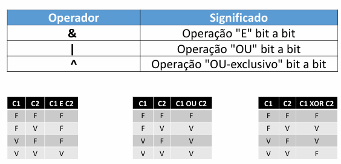
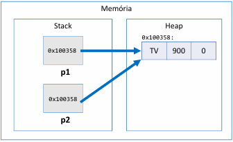
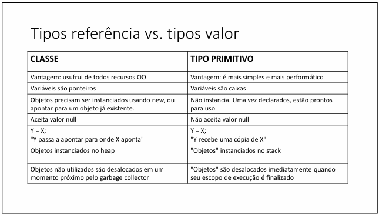
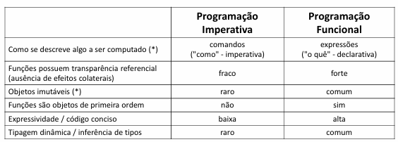

# Java - Conceitos Básicos

## Introdução ao Java

### JVM - Java Virtual Machine

Maquina Virtual do Java (JVM) é uma máquina virtual que permite que computadores executem programas Java, alem de permitir desenvolver os aplicativos em Java.

package = agrupamento lógico de classes e interfaces relacionadas.
modulo = agrupamento lógico de pacotes relacionados.
runtime = agrupamento físico (arquivos).
aplicação = conjunto de módulos relacionados.

## Códigos Java Básicos

`sysout` = atalho para `System.out.println();``

Exemplo de código Java:
`System.out.print("Olá mundo!");`
Codiigo para imprimir algo no console.

`System.out.println("Olá mundo!");`
Codiigo para imprimir algo no console e o "ln" faz com que tenha quebra de linha.

Exemplo de formatação de números:

```Java
 double x = 10.35784;
 System.out.println(x);
 System.out.printf("%.2f%n", x);
 System.out.printf("%.4f%n", x);
 Locales.setDefault(Locale.US);
 System.out.printf("%.4f%n", x);
```

### Casting

Caso eu tenha duas variaveis de numeros inteiros e eu queira fazer uma divisão entre elas, o resultado será um número inteiro, mesmo que o resultado da divisão seja um número decimal. Para resolver isso, eu posso fazer um "casting" de uma das variaveis para double, assim o resultado será um número decimal.

```Java
 int a, b;
 a = 5;
 b = 2;
 double resultado = (double) a / b;
 System.out.println(resultado);
```

O casting seria como se fosse o parse no C#.

### Entrada de Dados

Para ler dados do usuário em Java, utilizamos a classe Scanner.

```Java
    import java.util.Scanner;
    public class Main {
        public static void main(String[] args) {
            Scanner sc = new Scanner(System.in);
            String x;
            x = sc.next();
            System.out.println("Você digitou: " + x);
            sc.close();
        }
    }
```

Para ler do tipo int:

```Java
int x;
x = sc.nextInt();
```

Para ler do tipo double:

```Java
double x;
x = sc.nextDouble();
```

Para ler dados da linha inteira :

```Java
string x;
x = sc.nextLine();
```

### Operações Matemáticas

Math.sqrt = raiz quadrada
Math.pow = potência
Math.abs = valor absoluto

## Debug

Debug é o processo de encontrar e corrigir erros no código. O processo de debug depende da IDE que você está utilizando. Vou explicar como fazer debug no IntelliJ e no Eclipse.

### Debug no IntelliJ

1. Coloque um breakpoint clicando na margem esquerda da linha onde você quer parar a execução
2. Clique no icone de debug (um bug) ou pressione Shift + F9
3. A execução do programa irá parar no breakpoint
4. Se você quiser indo avançando ao longo do codigo linha por linha, pressione F10 (Step Over)

### Debug no Eclipse

1. Coloque um toggle breakpoint clicando na margem esquerda da linha onde você quer parar a execução
2. Clique no arquivo -> Debug As -> Java Application ou pressione F11
3. A execução do programa irá parar no breakpoint
4. Se você quiser indo avançando ao longo do codigo linha por linha, pressione F6(Step Over)

## Codigos de Java

### Estrutura Repetitiva - do While

Bloco de comandos executa pelo menos uma vez, pois a condição é verificada no final.

```Java
 do {
//bloco de comandos
 } while(condição);
```

## Convenções de Nomenclatura em Java

### CamelCase: lastName

pacotes
atributos
métodos
variáveis e parâmetros

### Pascal Case: ProductService

classes

## Bitwise

Operadores bit a bit operam diretamente nos bits dos números inteiros.


## Funções Strings

1. Formatar: toLowerCase(), toUpperCase(), trim()
2. Recortar: substring(inicio), substring(inicio, fim)
3. Substituir: Replace(char, char), Replace(string, string)
4. Buscar: IndexOf, LastIndexOf
5. str.Split(" ")

### Split

```Java
 String s = "potato apple lemon";
String[] vect = s.split(" ");
String word1 = vect[0];
String word2 = vect[1];
String word3 = vect[2]
```

## Funções

As funções do Java são criadas embaixo da public static void main(String[] args) {}

## Classes e Instanciação de Objeto

Na pasta entities é criada a classe com os atributos e métodos. Na pasta application é onde o programa principal é executado.

```Java
package entities;

    public class Triangle {
            public double a;
            public double b;
            public double c;
    }
```

```Java
package application;

    import entities.Triangle;
                    Triangle x, y;
                    x = new Triangle();
                    y = new Triangle();
```

## Constantes

Constantes são variáveis que não podem ter seu valor alterado durante a execução do programa. Em Java, as constantes são declaradas utilizando a palavra-chave `final` e geralmente são escritas em letras maiúsculas com palavras separadas por underscores `_`.

```Java
public static final double PI = 3.14159;
```

## Metodos Estáticos

Métodos estáticos pertencem à classe em si, e não a uma instância específica da classe. Eles podem ser chamados sem a necessidade de criar um objeto da classe.

Ou seja, são funções que estão no mesmo arquivo da classe principal e podem ser chamadas diretamente.

```Java
    public class Program {
        public static final double PI= 3.14159;

        public static void main (String[] args) {
            double c = circumference(radius);
            double v = volume(radius);
        }

        public static double circumference(double radius) {
            return 2.0 * PI * radius;
        }

        public static double volume(double radius) {
            return 4.0 * PI * radius * radius * radius / 3.0;
        }
    }
```

Tambem é possível chamar métodos estáticos de outras classes, mas diferente de metodos de instância, não é necessário criar um objeto da classe para chamar o método estático.

```Java
 double result = Calculator.volume(25.0);
```

## Construtores

Construtores são métodos especiais usados para inicializar objetos de uma classe. Eles têm o mesmo nome da classe.

```Java
public class Product {

    public String name;
    public double price;
    public int quantity;

    public Product(String name, double price, int quantity) {
        this.name = name;
        this.price = price;
        this.quantity = quantity;
    }
}
```

## Sobrecarga de Construtores

A sobrecarga de construtores permite que uma classe tenha múltiplos construtores com diferentes listas de parâmetros. Isso possibilita a criação de objetos de maneiras diferentes, dependendo dos dados disponíveis no momento da instânciação.
Tambem podemos ter um construtor padrão (sem parâmetros).

## Encapsulamento

Encapsulamento é a restrição do acesso direto aos dados de um objeto, tendo que utilizar métodos específicos para acessar e modificar esses dados (getters e setters).
Primeiro temos que definir os atributos como private e depois criar os métodos `get` e `set`.

```Java
    public class Product {
            private String name;

            public String getName() {
                    return name;
            }

            public void setName(String name) {
                    this.name = name;
            }
    }
```

## Gerando Construtores, Getters e Setters Automaticamente no IntelliJ

1. Clique com o botão direito dentro da classe onde você deseja gerar o construtor, getters e setters.
2. Selecione "Generate..." ou pressione `Alt + Insert`.
3. Escolha "Constructor" para gerar o construtor, "Getter" para gerar os getters, ou "Setter" para gerar os setters.
4. Selecione os atributos que você deseja incluir e clique em "OK".

## Modificadores de Acesso

private = acessível apenas dentro da própria classe.
(nada) = acessível dentro do mesmo pacote.
protected = acessível dentro do mesmo pacote e em subclasses.
public = acessível de qualquer lugar.

## Classes não tem valor

Variaveis do tipo classe armazenam referências para objetos na memória, e não os próprios objetos.




## Vetores

### Arranjo (array) é uma estrutura de dados

Homogênea (dados do mesmo tipo)
Ordenada (elementos acessados por meio de posições)
Alocada de uma vez só, em um bloco contíguo de memória

### Vantagens

Acesso imediato aos elementos pela sua posição

### Desvantagens

Tamanho fixo
Dificuldade para se realizar inserções e deleções.

### Estrutura de criação de um vetor

```Java
tipo[] nomeDoVetor = new tipo[tamanho];
```

```Java
double[] nomeDoVetor = new double[10];
```

### Inserindo valores em um vetor

No exemplo abaixo, o usuário informa o tamanho do vetor e depois insere os valores, utilizando de um `for` para percorrer o vetor e inserir os valores.

```Java
int n =sc.nextInt();
double[] vect = new double[n];
  for (int i=0; i<n; i++){
    vect[i] = sc.nextDouble();
  }
```

### Criação de um vetor numa classe

```Java
public class Product {

    private String name;
    private double price;
}
```

```Java
        Locale.setDefault(Locale.US);
        Scanner sc = new Scanner(System.in);

        int n = sc.nextInt();
        Product[] vect = new Product[n];

        for (int i = 0; i < vect.length; i++){
            sc.nextLine();
            String name = sc.nextLine();
            double price = sc.nextDouble();
            vect[i] = new Product(price, name);
        }
```

### Boxing e Unboxing

Boxing é o processo de converter um tipo primitivo em um objeto do tipo referência correspondente. Unboxing é o processo inverso, onde um objeto do tipo referência é convertido de volta para um tipo primitivo.

```Java
int x = 10; // tipo primitivo
Object obj = x; // Boxing
int y = (int) obj; // Unboxing
```

### Wrappers

Wrappers são classes que encapsulam tipos primitivos em objetos. Cada tipo primitivo em Java tem uma classe wrapper correspondente. Assim, não é preciso fazer boxing e unboxing manualmente, pois o Java faz isso automaticamente.
A vantagem de usar wrappers é que eles permitem que sejam nulos.

| Tipo Primitivo | Classe Wrapper |
| -------------- | -------------- |
| int            | Integer        |
| double         | Double         |
| boolean        | Boolean        |
| char           | Character      |
| long           | Long           |
| float          | Float          |
| byte           | Byte           |
| short          | Short          |

```Java
int x = 10; // tipo primitivo
Interger obj = x; // Boxing
int y = obj; // Unboxing
```

## Laços For Each

O laço for each é uma forma simplificada de percorrer elementos em arrays ou coleções.

```Java
    for (tipo item : coleção) {
            // bloco de comandos
    }
```

```Java
String[] vect = new String[] {"Ana", "Bruno", "Carlos"};
    for (String nome : vect) {
            System.out.println(nome);
    }
```

## Listas

### Lista é uma estrutura de dados

• Homogênea (dados do mesmo tipo)
• Ordenada (elementos acessados por meio de posições)
• Inicia vazia, e seus elementos são alocados sob demanda
• Cada elemento ocupa um "nó" (ou nodo) da lista

• Tipo (interface): List
• Classes que implementam: ArrayList, LinkedList, etc.

### Vantagens

• Tamanho variável
• Facilidade para se realizar inserções e deleções

### Desvantagens

• Acesso sequencial aos elementos\*.

### Estrutura de criação de uma lista

```Java
List<tipo> nomeDaLista = new ArrayList<>();
```

### Comandos básicos para listas

```Java
nomeDaLista.add(elemento); // Adiciona um elemento no final da lista
nomeDaLista.add(indice, elemento); // Adiciona um elemento em uma posição específica
nomeDaLista.size(); // Retorna o tamanho da lista
nomeDaLista.remove(indice); // Remove o elemento de uma posição específica
nomeDaLista.remove(elemento); // Remove a primeira ocorrência do elemento
nomeDaLista.removeIf(x -> condição); // Remove todos os elementos que satisfazem a condição
nomeDaLista.indexOf(elemento); // Retorna o índice da primeira ocorrência do elemento
List<tipo> subLista = nomeDaLista.stream().filter(x -> condição).collect(Collectors.toList()); // Cria uma sublista com elementos que satisfazem a condição
```

## Matriz

Em programação, "matriz" é o nome dado a arranjos bidimensionais

### Arranjo (array) é uma estrutura de dados

• Homogênea (dados do mesmo tipo)
• Ordenada (elementos acessados por meio de posições)
• Alocada de uma vez só, em um bloco contíguo de memória

### Vantagens

• Acesso imediato aos elementos pela sua posição

### Desvantagens

• Tamanho fixo
• Dificuldade para se realizar inserções e deleções

### Estrutura de criação de uma matriz

```Java
// Bidimensional
tipo[][] nomeDaMatriz = new tipo[linhas][colunas];

// Tridimensional
tipo[][][] nomeDaMatriz = new tipo[linhas][colunas];
```

## Datas e Horas

### Data-[hora] local

ano-mês-dia-[hora] sem fuso horário
[hora] opcional

### Data-hora global

ano-mês-dia-hora com fuso horário

### Duração

tempo decorrido entre duas data-hora.

## Definição de Data-Hora

```Java
LocalDate d01 = LocalDate.now(); // Data atual
LocalDateTime d02 = LocalDateTime.now(); // Data e hora atual
Instant d03 = Instant.now(); // Data e hora atual em UTC

LocalDate d04 = LocalDate.parse("2024-06-25"); // Data a partir de uma string
LocalDateTime d05 = LocalDateTime.parse("2024-06-25T15:30:45"); // Data e hora a partir de uma string
Instant d06 = Instant.parse("2024-06-25T15:30:45Z"); // Data e hora em UTC a partir de uma string
Instant d06 = Instant.parse("2024-06-25T15:30:45-03:00"); // Data e hora em UTC a partir de uma string no fuso de São Paulo
```

### Formatação de Data-Hora

[Documentação do DateTimeFormatter](https://docs.oracle.com/javase/8/docs/api/java/time/format/DateTimeFormatter.html)

```Java
DateTimeFormatter fmt1 = DateTimeFormatter.ofPattern("dd/MM/yyyy");
LocalDate d04 = LocalDate.parse("25/06/2024", fmt1); // Data a partir de uma string num formato específico
```

### Formatação de Data-Hora para saída

```Java
DateTimeFormatter fmt2 = DateTimeFormatter.ofPattern("dd/MM/yyyy");
DateTimeFormatter fmt3 = DateTimeFormatter.ofPattern("dd/MM/yyyy").withLocale(ZoneId.systemDefault()); // Formatação de data para string com localidade
DateTimeFormatter fmt4 = DateTimeFormatter.ISO_DATE;
 // Formatação de data e hora para string
String s1 = d04.format(fmt2); // Formatação de data para string
System.out.println(d04.format(fmt3)); // Formatação de data para string
String s1 = d04.format(fmt4); // Formatação de data para string
// ou
String s2 = fmt2.format(d04); // Formatação de data para string

LocalDate r2 = LocalDate.ofInstant(d06, ZoneId.of("Portugal")); // Converter Instant para LocalDate no fuso local
d04.getDayOfMonth(); // Obter o dia do mês
d04.getMonthValue(); // Obter o mês
d04.getYear(); // Obter o ano
d04.getHour(); // Obter a hora
d04.getMinute(); // Obter os minutos

```

### Operações com Data-Hora

```Java
d04.plusDays(7); // Adicionar 7 dias
d04.plusMonths(6); // Adicionar 6 meses

d04.minusDays(7); // Subtrair 7 dias
d04.minusMonths(6); // Subtrair 6 meses
d04.until(d07, ChronoUnit.DAYS); // Diferença em dias entre d04 e d07
Duration.between(d06, d08).toDays(); // Diferença em dias entre
Duration.between(d06, d08).toHours(); // Diferença em horas entre
Duration.between(d06, d08).toMinutes(); // Diferença em minutos entre

Duration t1 = Duration.between(d06.atTime(0, 0), d08.atTime(0, 0)); // Diferença entre duas datas
Duration t1 = Duration.between(d06.atStartOfDay(), d08.atStartOfDay()); // Diferença entre duas datas
sout.println("Diferença em dias: " + t1.toDays());
```

## Enumerações

[Documentação sobre Enumeração](https://docs.oracle.com/javase/tutorial/java/javaOO/enum.html)

•É um tipo especial que serve para especificar de forma literal um conjunto de constantes relacionadas
•Palavra chave em Java: enum
•Vantagem: melhor semântica, código mais legível e auxiliado pelo compilador

Ou seja, é um tipo que cria um tipo que você.

```Java
    public enum OrderStatus {
        PENDING_PAYMENT,
        PROCESSING,
        SHIPPED,
        DELIVERED
    }
```

E essas enumerações ficam em um pacote separado, geralmente chamado de `entities.enums`.
Os exercicios 15 e 16 do curso Java Completo da Udemy utilizam enumerações.

## StringBuilder

StringBuilder é uma classe em Java que permite criar e manipular strings de forma mais eficiente do que a classe String tradicional, especialmente quando se trata de operações que envolvem muitas concatenações ou modificações de strings.

```Java
    public String toString() {
        StringBuilder sb = new StringBuilder();
        sb.append(title + "\n");
        return sb.toString();
    }
```

O StringBuilder tem que ser declarado dentro do método que vai ser utilizado, e no final do método é necessário retornar o StringBuilder convertido para String com o método `toString()`.

## Herança

Herança permite que uma classe (subclasse ou classe derivada) herde atributos e métodos de outra classe (superclasse ou classe base).
A palavra-chave `extends` é usada para indicar que uma classe herda de outra.
A classe base não tem nenhuma mudança, já na classe derivada, precisamos usar a palavra-chave `extends` seguida do nome da classe base e tambem o construtor da classe derivada deve chamar o construtor da classe base usando a palavra-chave `super`.

```Java
public class BusinessAccount extends Account {
    private Double loanLimit;

    public BusinessAccount() {
        super();
    }

    public BusinessAccount(Integer number, String holder, Double balance, Double loanLimit) {
        super(number, holder, balance);
        this.loanLimit = loanLimit;
    }
}
```

## Upcasting e Downcasting

Upcasting é o processo de converter uma referência de um objeto de uma subclasse para uma superclasse. Downcasting é o processo inverso, onde uma referência de um objeto de uma superclasse é convertida para uma subclasse.

Upcasting:

```Java
Account acc1 = bacc;
Account acc2 = new BusinessAccount(1003, "Bob", 0.0, 200.0);
Account acc3 = new SavingsAccount(1004, "Ana", 0.0, 0.01);
```

Downcasting:

```Java
BusinessAccount acc4 = (BusinessAccount) acc2;

        // Errado, mas só aparece o erro na hora de compilar
        // BusinessAccount acc5 = (BusinessAccount) acc3;

        if (acc3 instanceof BusinessAccount) {
            BusinessAccount acc5 = (BusinessAccount) acc3;
            acc5.loan(200.0);
        }
```

O operador `instanceof` é usado para verificar se um objeto é uma instância de uma classe específica antes de fazer o downcasting, evitando erros na execução.

## Sobrescrita de Métodos

É a implementação de um método em uma subclasse que já foi definido na superclasse.
É recomendado usar a anotação `@Override` acima do método sobrescrito para indicar que você está intencionalmente sobrescrevendo um método da superclasse.

```Java
    @Override
    public void withdraw(Double amount) {
        balance -= amount;
    }
```

## Final

A palavra-chave `final` em Java impede que uma classe seja herdada ou que um método seja sobrescrito.
O `final` pode ser usado em classes e métodos, e ele tende a deixar o código mais seguro e otimizado.

```Java
public final class MathUtils {
// Esta classe não pode ser estendida
}
```

```Java
    public class BaseClass {
            public final void display() {
                    System.out.println("Este método não pode ser sobrescrito.");
            }
    }
```

## Polimorfismo

Polimorfismo nada mais é do que um método ter o mesmo nome, mas comportamentos diferentes dependendo do objeto que o chama. Então quando um método é sobrescrito em uma subclasse, o comportamento do método pode variar dependendo do tipo do objeto que o chama.

## Classes Abstratas

São classes que não podem ser usadas diretamente, elas só servem como base para outras classes.
Pode também servir para tipos de listas genéricas, onde a lista pode armazenar objetos de diferentes subclasses que herdam da classe abstrata.

```Java
public abstract class Animal {}
```

## Métodos Abstratos

Igual as classes abstratas, os métodos abstratos não possuem implementação na classe base, e devem ser implementados nas subclasses.
Serve para metodos que são muito específicos de cada subclasse ou algo muito genérico que todas as subclasses devem implementar. E se o método for abstrato, a classe que o contém também deve ser abstrata.
O método abstrato se torna obrigatório para todas as subclasses implementarem, tendo que ser sobrescrito.

```Java
    public abstract void makeSound();
```

## Estrutura try-catch

A estrutura try-catch é usada para tratar exceções em Java. O código que pode gerar uma exceção é colocado dentro do bloco `try`, e o tratamento da exceção é feito no bloco `catch`.

```Java
try {
    // código que pode gerar uma exceção
} catch (TipoDaExceção e) {
    // tratamento da exceção
}
```

### Exemplo de uso do try-catch

```Java
try{
    String[] vect = sc.nextLine().split(" ");
    int position = sc.nextInt();
    System.out.println(vect[position]);
} catch (ArrayIndexOutOfBoundsException e) {
    System.out.println("Invalid position! ");
}
catch (InputMismatchException e) {
    System.out.println("Input error! ");
}
```

## Estrutura de arquivos sugerida

```Java
model
  entities
  enums
  exceptions
  services
```

## Throws Exception

Colocar o `throws Exception` na assinatura do método indica que o método pode lançar uma exceção, e que o chamador do método deve estar preparado para lidar com essa exceção. Ou seja, o método não trata a exceção internamente, mas sim propaga a responsabilidade de tratamento para o código que o chamou.

## throw new

Quando você está desenvolvendo um método e quer indicar que uma condição específica é um erro, você pode usar a instrução `throw new` para lançar uma exceção personalizada. Isso permite que você crie suas próprias exceções para situações específicas no seu código.

```Java
if (amount <= 0) {
    throw new IllegalArgumentException("Amount must be positive");
}
```

Assim você pode tratar essa exceção no método que chamou esse método, utilizando o try-catch.

Construtores também podem lançar exceções utilizando o `throw new`, caso alguma condição não seja atendida durante a criação do objeto.

```Java
public Product(String name, double price) {
    if (price < 0) {
        throw new IllegalArgumentException("Price cannot be negative");
    }
    this.name = name;
    this.price = price;
}
```

## Exceções Personalizadas

Você pode criar suas próprias classes de exceção personalizadas em Java, estendendo a classe `Exception` ou `RuntimeException`. Isso é útil quando você deseja representar erros específicos do seu domínio de aplicação.

```Java
    public class DomainException extends RuntimeException {
        private static final long serialVersionUID = 1L;

        public DomainException(String msg) {
            super(msg);
        }
    }
```

Depois você pode lançar essa exceção personalizada em qualquer lugar do seu código usando a instrução `throw new DomainException("mensagem de erro")`.

## Lendo arquivos

Para ler arquivos você pode usar o Scanner. O arquivo deve ser importado com o caminho completo em uma variavel do tipo File.

```Java
    File file = new File("C:\\temp\\files\\aa.txt");
        Scanner sc = null;
        try {
            sc = new Scanner(file);
            while (sc.hasNextLine()) {
                System.out.println(sc.nextLine());
            }
        } catch (IOException e) {
            System.out.println("Erro ao ler o arquivo: " + e.getMessage());
        } finally {
            if (sc != null) {

                sc.close();
            }
        }
```

## FileReader e BufferedReader

O FileReader é usado para ler caracteres de um arquivo, enquanto o BufferedReader é usado para ler texto de forma eficiente, armazenando os caracteres em um buffer.

```Java
String path = "C:\\temp\\files\\aa.txt";
        FileReader fr = null;
        BufferedReader br = null;

        try{
            fr = new FileReader(path);
            br = new BufferedReader(fr);
            // br = new BufferedReader(new FileReader(path));

            String line = br.readLine();
            while(line != null){
                System.out.println(line);
                line = br.readLine();
            }
        }
        catch(IOException e){
            System.out.println(e.getMessage());
        }
        finally{
            try {
                if(br != null){
                    br.close();
                }
                if(fr != null){
                    fr.close();
                }
            } catch (IOException ex) {
                System.out.println(ex.getMessage());
            }

        }
```

## FileWriter e BufferedWriter

O FileWriter é usado para escrever caracteres em um arquivo, enquanto o BufferedWriter é usado para escrever texto de forma eficiente, armazenando os caracteres em um buffer antes de escrevê-los no arquivo.

```Java
        String[] lines = new String[]{"Good morning", "Good afternoon", "Good evening"};
        String path = "C:\\temp\\files\\out.txt";

        try (BufferedWriter bw = new BufferedWriter(new FileWriter(path))) {
            for (String line : lines) {
                bw.write(line); // Escreve a linha no arquivo
                bw.newLine(); // Adiciona uma nova linha / quebra de linha
            }
        } catch (IOException e) {
            e.printStackTrace();
        }
```

`BufferedWriter bw = new BufferedWriter(new FileWriter(path))` Essa linha cria um novo arquivo no caminho especificado por `path`. Se o arquivo já existir, ele será sobrescrito. Agora se adicionar `true` como segundo parâmetro em `FileWriter`, o conteúdo será adicionado ao final do arquivo existente. Dessa forma:

```Java
BufferedWriter bw = new BufferedWriter(new FileWriter(path, true))
```

### Listar pastas de um diretório

```Java
        System.out.println("Enter a folder path: ");
        String strPath = sc.nextLine();

        File path = new File(strPath);

        File[] folders = path.listFiles(File::isDirectory);
        System.out.println("Folders: ");

        for (File folder : folders) {
            System.out.println(folder);
        }
```

### Listar arquivos de um diretório

```Java
        System.out.println("Enter a folder path: ");
        String strPath = sc.nextLine();

        File[] files = path.listFiles(File::isFile);
        System.out.println("Files: ");

        for (File file : files) {
            System.out.println(file);
        }
```

### Criar uma pasta

```Java
        boolean sucess = new File(strPath + "\\subdir").mkdir();
        System.out.println("Folder created: " + sucess);
```

### Outros comandos úteis com arquivos

```Java
        System.out.println("GetName: " + path.getName()); // Nome do arquivo ou pasta
        System.out.println("GetParent: " + path.getParent()); // Caminho do diretório pai
        System.out.println("GetPath: " + path.getPath()); // Caminho completo do arquivo ou pasta
```

## Interfaces

Exercício de Interfaces é o 024.

Interfaces são contratos que definem um conjunto de métodos que uma classe deve implementar. Elas permitem a criação de código mais flexível e reutilizável.

Voce faz um codigo onde consoma a interface e depois cria classes que implementam essa interface. Assim você pode trocar as implementações sem alterar o código que consome a interface, por exemplo, em um sistema de pagamento onde você pode ter diferentes métodos de pagamento (cartão de crédito, PayPal, boleto bancário), você pode definir uma interface `PaymentMethod` com um método `processPayment()`. Cada método de pagamento pode ser implementado em uma classe separada que implementa a interface `PaymentMethod`. Ou uma interface que tenha o banco de dados e depois você pode colocar qualquer banco de dados que implemente essa interface.

```Java
public interface TaxService {
    double tax(double amount);
}

```

```Java
public class BrazilTaxService implements TaxService {
    public double tax(double amount) {
    // Regras de negócio
    }
}
```

```Java
public class RentalService {
    private Double pricePerHour;
    private Double pricePerDay;

    private TaxService taxService; // Onde vc iria usar a class diretamente, vc agora usa a interface

    // Construtor e outros métodos
}
```

## Problema do Diamante

Esse problema acontece quando há uma ambiguidade na herança múltipla, onde uma classe herda de duas classes que possuem um método com o mesmo nome. Por isso a herança múltipla de classes não é permitida em Java.

Uma classe pode implementar múltiplas interfaces, o que permite que uma classe reutilize código de várias fontes sem enfrentar o problema do diamante.

```Java
public interface A {
    void method();
}
public interface B extends A {
    void method();
}
public class C implements B, C {
    public void method() {
    }
}
```

## Classe ComparableTo

Uma classe que implementa a interface Comparable deve sobrescrever o método compareTo, que é usado para comparar.O método compareTo deve retornar um valor negativo se o objeto atual for menor que o outro objeto, um valor positivo se for maior, e zero se forem iguais.

```Java
public class Product implements Comparable<Product> {
    @Override
    public int compareTo(Product other) {
        return this.price.compareTo(other.getPrice());
    }
}
```

## Interface Comparable

```Java
public interface Comparable<T> {
    int compareTo(T o);
}
```

## Collections

Collections.sort(nomeDaLista);
Essa função ordena a lista em ordem crescente, desde que o tipo da lista implemente a interface Comparable.

## Default Methods / Defender methods em Interfaces

São metodos que ficam dentro da interface, mas que possuem uma implementação padrão. Assim, o metodo não ira ter que ser sobrescrito nas classes que implementam a interface.

```Java
public interface MyInterface {
    default void myDefaultMethod() {
        System.out.println("This is a default method.");
    }
}
```

## Generics

Serve para criar classes que funcionam com diferentes tipos de dados, na classe você define um tipo genérico usando `<T>`, e na instanciação da classe, você especifica o tipo que deseja usar.

```Java
public class Services<T> {
    private List<T> list = new ArrayList<>();

    public void setItem(T item) {    }

    public T getItem() {    }
}
```

```Java
Box<String> stringBox = new Box<>();
```

## Tipos Coringa

Tipos coringa (wildcard types) em Java são usados em generics. Eles são representados pelo símbolo `?` e podem ser usados para indicar que um tipo genérico pode ser qualquer tipo.
Mas tem algumas restrições, por exemplo, você não pode adicionar elementos.

### Coringa delimitados

Caso você queira alguma lista que as informações sejam de um tipo específico ou subtipos, você pode usar o coringa delimitado com `extends`.

```Java
List<? extends Shape> list = new ArrayList<>();
```

No exemplo acima, a lista pode conter objetos do tipo Shape ou qualquer subtipo de Shape, como Circle ou Rectangle.

## Covariância e Contravariância

Covariância permite que você use um tipo mais específico do que o tipo genérico declarado. Contravariância permite que você use um tipo mais genérico do que o tipo genérico declarado.

### Covariância

Pode fazer o get, mas não o put.

```Java
List<Integer> intList = new ArrayList<Integer>();
intList.add(10);
intList.add(5);
List<? extends Number> list = intList;
Number x = list.get(0);
list.add(20); // erro de compilacao
```

### Contravariância

Pode fazer o put, mas não o get.

```Java
List<Object> myObjs = new ArrayList<Object>();
myObjs.add("Maria");
myObjs.add("Alex");
List<? super Number> myNums = myObjs;
myNums.add(10);
myNums.add(3.14);
Number x = myNums.get(0); // erro de compilacao
```

### Método de copia de listas

Abaixo um exemplo de método que copia elementos de uma lista para outra, utilizando tipos coringa delimitados para permitir a cópia de listas de diferentes tipos numéricos. Assim, podemos montar uma lista com dois tipos diferentes de números (Integer e Double).
Tambem temos um método para imprimir a lista, utilizando o coringa simples `?`, que permite imprimir listas de qualquer tipo.

```Java
    public static void main(String[] args) {

        List<Integer> myInts = Arrays.asList(1, 2, 3, 4);
        List<Double> myDoubles = Arrays.asList(3.14, 6.28);
        List<Object> myObjs = new ArrayList<Object>();

        copy(myInts, myObjs);
        printList(myObjs);
        copy(myDoubles, myObjs);
        printList(myObjs);

    }

    public static void copy(List<? extends Number> source, List<? super Number> destiny) {
        for (Number number : source) {
            destiny.add(number);
        }
    }

    public static void printList(List<?> list) {
        for (Object obj : list) {
            System.out.print(obj + " ");
        }
        System.out.println();
    }
```

## Equals e HashCode

Os métodos `equals` e `hashCode` são usados para comparar objetos em Java. O método `equals` verifica se dois objetos são iguais, enquanto o método `hashCode` retorna um valor inteiro que representa o objeto.
O `hashCode` é mais rapido do que o `equals`, por isso é usado o hashCode para fazer uma comparação inicial, e se os hashCodes forem iguais, ai sim é feito o equals para verificar se os objetos são realmente iguais.
Para criar esses métodos automaticamente no IntelliJ, clique com o botão direito dentro da classe, selecione "Generate" e escolha "equals() and hashCode()". Depois selecione os atributos que você quer considerar na comparação.

## Set

O Set é uma coleção que não permite elementos duplicados. Ele é usado quando você quer garantir que cada elemento seja único dentro da coleção.

### HashSet

O HashSet é uma implementação da interface Set que utiliza uma tabela hash para armazenar os elementos. Ele é o mais rápido, mas não mantém a ordem dos elementos.

```Java
Set<String> set = new HashSet<>();
set.add("Maria");
set.remove("Maria");
set.removeIf(x -> x.length() > 3);
```

### TreeSet

Ele é o mais lento, mas mantém os elementos ordenados. Ele é ordenado pelo método compareTo da classe dos objetos armazenados, ou por um Comparator fornecido no momento da criação do TreeSet.

```Java
Set<String> set = new TreeSet<>();
set.add("Maria");
set.add("Alex");
```

### LinkedHashSet

Mais lento que o HashSet, mas mais rápido que o TreeSet. Mantém a ordem de inserção dos elementos.

```Java
Set<String> set = new LinkedHashSet<>();
set.add("Maria");
set.add("Alex");
```

### Métodos principais da interface Set

```Java
add("item") // Adiciona um elemento no conjunto
remove("item") // Remove um elemento do conjunto
contains("item") // Verifica se o conjunto contém o elemento
clear() // Remove todos os elementos do conjunto
size() // Retorna o número de elementos no conjunto
removeIf(predicate) // Remove elementos que satisfazem o predicado
addAll(other) // União: adiciona no conjunto os elementos do outro conjunto, sem repetição
retainAll(other) // Interseção: remove do conjunto os elementos não contidos em other
removeAll(other) // Diferença: remove do conjunto os elementos contidos em other
```

### Contains no Set

O método `contains` no Set usa o `hashCode` e o `equals` para verificar se um elemento está presente no conjunto. Caso seja uma classe personalizada, é importante sobrescrever esses métodos para garantir o funcionamento correto do `contains`.

## Map

O Map é uma coleção que armazena pares de chave-valor. Ele é usado quando você quer associar um valor a uma chave específica. Ele não permite chaves duplicadas, mas permite valores duplicados.

Uso comum: cookies, local storage, qualquer modelo chave-valor

```Java
Map<Integer, String> map = new HashMap<>();
map.put(1, "Maria");
```

### Métodos chave

```Java
put(chave, valor) // Adiciona um par chave-valor ao mapa
get(chave) // Retorna o valor associado à chave
remove(chave) // Remove o par chave-valor do mapa
containsKey(chave) // Verifica se o mapa contém a chave
containsValue(valor) // Verifica se o mapa contém o valor
clear() // Remove todos os pares chave-valor do mapa
size() // Retorna o número de pares chave-valor no mapa
keySet() // Retorna um conjunto com todas as chaves do mapa
values() // Retorna uma coleção com todos os valores do mapa

// forEach
map.forEach((key, value) -> {
    System.out.println("Key: " + key + ", Value: " + value);
});

for (String key : map.keySet()) {
    System.out.println(key + ", Value: " + map.get(key));
}
```

## Comparator

### Classe Comparator

Ao inves de colocar `Collectons.sort(nomeDaLista);`, voce pode criar uma classe que implemente a interface Comparator, e passar essa classe como parametro para o list.sort(). Assim a ordenação sera feita de acordo com o que voce definiu na classe Comparator.

```Java
    public class MyComparator implements Comparator<Product> {
        @Override
        public int compare(Product p1, Product p2) {
            return p1.getName().toUpperCase().compareTo(p2.getName().toUpperCase());
        }
    }
```

```Java
    list.sort(new MyComparator());
```

### Classe Comparator anônima

Podemos também criar a classe Comparator como uma classe anônima, sem a necessidade de criar um arquivo separado para ela.

```Java
    Comparator<Product> comp = new Comparator<Product>() {
        @Override
        public int compare(Product p1, Product p2) {
            return p1.getName().toUpperCase().compareTo(p2.getName().toUpperCase());
        }
    };
```

```Java
    list.sort(comp);
```

### Expressão Lambda como Comparator

Podemos também usar uma expressão lambda para criar o Comparator de forma mais concisa.

```Java
    Comparator<Product> comp = (p1, p2) -> p1.getName().toUpperCase().compareTo(p2.getName().toUpperCase());
```

```Java
    list.sort(comp);

```

### Usando expressão lambda diretamente no sort

```Java
    list.sort((p1, p2) -> p1.getName().toUpperCase().compareTo(p2.getName().toUpperCase()));
```

## Expressão Lambda

Expressões lambda são uma forma concisa de representar funções anônimas em Java. Elas são usadas principalmente para implementar interfaces funcionais, que são interfaces com um único método abstrato.
**Elas basicamente são arrow functions**.

## Programação Imperativa vs Funcional



## Interface Funcional

Interfaces funcionais são interfaces que possuem apenas um método abstrato. Elas são usadas como alvos para expressões lambda e referências de método em Java.

### Interface Predicate

A interface Predicate representa uma função que recebe um argumento e retorna um valor booleano. Ela é usada para testar se um objeto satisfaz uma determinada condição.

```Java
public interface Predicate<T> {
    boolean test(T t);
}
```

Ela pode ser usada dentro de uma classe de serviço para filtrar uma lista de objetos com base em uma condição específica.

```Java
    public class ProductService implements Predicate<Product> {
        @Override
        public boolean test(Product p) {
            return p.getPrice() >= 100.0;
        }
    }
```

```Java
    list.removeIf(new ProductService());
```

Ou pode ser um método estático dentro da classe de serviço.

```Java
    public class ProductService {
        public static boolean staticProductPredicate(Product p) {
            return p.getPrice() >= 100.0;
        }
    }
```

```Java
    list.removeIf(ProductService::staticProductPredicate);
```

Ou pode ser uma expressão lambda diretamente no removeIf.

```Java
    list.removeIf(p -> p.getPrice() >= 100.0);
```

### Interface Consumer

Ele tambem pode ser feito de diferentes formas, como uma classe que implementa a interface Consumer, um método estático, ou uma expressão lambda, mas o mais comum é usar a expressão lambda diretamente no forEach.

```Java
    list.forEach(p -> p.setPrice(p.getPrice() * 1.1));
```

### Interface Function

```Java
    list.stream().map(p -> p.getName().toUpperCase()).collect(Collectors.toList());
```

## Funções que tem outras funções como parâmetros

Você pode criar métodos que recebem funções como parâmetros, usando interfaces funcionais como Predicate, Function, Consumer, etc. Isso permite que você crie métodos mais genéricos e reutilizáveis.

```Java
    public double filter(List<T> list, Predicate<T> predicate) {
        double sum = 0.0;
        for (T item : list) {
            if (predicate.test(item)) {
                sum += item.getPrice();
            }
        }
        return sum;
    }
```

```Java
    double sum = ps.filteredSum(products, p -> p.getPrice() >= 100.0);
```

## Stream

Streams são sequências de elementos que suportam operações funcionais para processamento de dados. Eles permitem que você processe coleções de forma declarativa, usando operações como map, filter, reduce, etc.

### Operações intermediárias

- filter: filtra os elementos com base em uma condição
- map: aplica uma função a cada elemento, transformando-os
- flatMap: transforma os elementos em uma stream de outro tipo e "achata" a estrutura
- peek: permite inspecionar os elementos sem modificá-los
- distinct: remove elementos duplicados
- sorted: ordena os elementos
- skip: pula os primeiros n elementos
- limit: limita o número de elementos (short-circuiting)

### Operações terminais

- forEach: executa uma ação para cada elemento
- forEachOrdered: executa uma ação para cada elemento, mantendo a ordem
- toArray: converte a stream em um array
- reduce: reduz os elementos a um único valor
- collect: coleta os elementos em uma coleção
- min: retorna o menor elemento
- max: retorna o maior elemento
- count: conta o número de elementos
- anyMatch: verifica se algum elemento satisfaz a condição
- allMatch: verifica se todos os elementos satisfazem a condição
- noneMatch: verifica se nenhum elemento satisfaz a condição
- findFirst: retorna o primeiro elemento
- findAny: retorna qualquer elemento

### Criando uma Stream

```Java
Stream<T> stream = list.stream(); // Cria uma stream a partir de uma coleção
Stream<String> stream = Stream.of("Maria", "Alex", "Bob"); // Cria uma stream a partir de valores
Stream<Integer> stream = Stream.iterate(0, x -> x + 2).limit(10); // Cria uma stream infinita e limita a 10 elementos
Stream<Double> stream = Stream.generate(() -> Math.random()).limit(5); // Cria uma stream infinita de números aleatórios e limita a 5 elementos
```

### Exemplos de uso do Stream

```Java
Strem<Long> fibo = Stream.iterate(new Long[]{0L, 1L}, p -> new Long[]{p[1], p[0] + p[1]}).map(p -> p[0]);
```

```Java
List<Integer> newList= list.stream()
    .filter(x-> x% 2 == 0)
    .map(x-> x* 10)
    .collect(Collectors.toList());
```

# Java com JDBC

## JDBC

É a sigla para Java Database Connectivity, que é uma API padrão para conectar e interagir com bancos de dados relacionais em Java.

## Adicionando JDBC ao projeto

Para utilizar o JDBC é necessário adicionar alguns arquivos.

1. Adicionar o driver JDBC do banco de dados que você está utilizando (por exemplo, MySQL Connector/J para MySQL).

### Como adicionar o driver JDBC no IntelliJ

1. No IntelliJ, vá para File > Project Structure (ou pressione Ctrl+Alt+Shift+S).

2. Selecione Libraries na barra lateral esquerda.

3. Clique no ícone `+` e selecione Java.

4. Navegue até o arquivo mysql-connector-j-x.x.x.jar que você acabou de baixar e selecione-o.

5. Clique em OK e aplique as alterações.

6. Adicionar um arquivo chamado `db.properties` na pasta raiz do projeto, com as informações de conexão com o banco de dados. Que seria tipo o `.env`.

```properties
user=dev
password=1234567
dburl=jdbc:mysql://localhost:3306/coursejdbc
useSSL=false
```

3. Criar um pacote chamado `db` para colocar a classe de conexão com o banco de dados.

4. Criar uma classe chamada `DbException` dentro do pacote `db`, que será responsável por tratar as exceções relacionadas ao banco de dados.

```Java
public class DbException extends RuntimeException {

    private static final long serialVersionUID = 1L;

    public DbException(String message) {
        super(message);
    }
}
```

5. Criar uma classe chamada `DB` dentro do pacote `db`, que será responsável por gerenciar a conexão com o banco de dados.

```Java
public class DB {

    private static Connection conn = null;

    public static Connection getConnection() {
        if (conn == null) {
            try {
                Properties props = loadProperties();
                String url = props.getProperty("dburl");
                conn = DriverManager.getConnection(url, props);
            } catch (SQLException e) {
                throw new DbException(e.getMessage());
            }
        }
        return conn;
    }

    public static void closeConnection() {
        if (conn != null) {
            try {
                conn.close();
            } catch (SQLException e) {
                throw new DbException(e.getMessage());
            }
        }
    }

    private static Properties loadProperties() {
        try (FileInputStream fs = new FileInputStream("db.properties")) {
            Properties props = new Properties();
            props.load(fs);
            return props;
        } catch (IOException e) {
            throw new DbException(e.getMessage());
        }
    }
}
```

## ResultSet e Statement

O Statement é uma interface que representa uma instrução SQL que pode ser executada contra o banco de dados. Ele permite que você execute consultas SQL e atualizações no banco de dados.

O ResultSet é uma interface que representa o resultado de uma consulta SQL. Ele permite que você navegue pelos dados retornados pela consulta e acesse os valores das colunas.

### PreparamentStatement

O PreparedStatement é uma subinterface do Statement que permite que você crie instruções SQL pré-compiladas. Ele é usado para executar consultas SQL com parâmetros, o que ajuda a prevenir ataques de injeção SQL e melhora o desempenho das consultas.

## Consulta - Read - Get

```Java
Connection conn = null;
        Statement st = null;
        ResultSet rs = null;

        try {
            conn = DB.getConnection();
            st = conn.createStatement();
            rs = st.executeQuery("SELECT * FROM department");

            while (rs.next()) {
                System.out.println(rs.getInt("Id") + ", " + rs.getString("Name"));
            }
        } catch (SQLException e) {
            e.printStackTrace();
        } finally {
            DB.closeResultSet(rs);
            DB.closeStatement(st);
            DB.closeConnection();
        }
```

## Inserção - Create - Set

```Java
SimpleDateFormat sdf = new SimpleDateFormat("dd/MM/yyyy");
        Connection conn = null;
        PreparedStatement st = null;

        try {
            conn = DB.getConnection();

            st = conn.prepareStatement(
                    "INSERT INTO seller "
                            + "(Name, Email, BirthDate, BaseSalary, DepartmentId) "
                            + "VALUES (?, ?, ?, ?, ?)"
            );
            st.setString(1, "Carlos");
            st.setString(2, "carlos@gmail.com");
            st.setDate(3, new java.sql.Date(sdf.parse("22/04/1982").getTime()));
            st.setDouble(4, 3000.00);
            st.setInt(5, 4);

            int rowsAffected = st.executeUpdate();

        } catch (SQLException e) {
            e.printStackTrace();
        } catch (ParseException e) {
            e.printStackTrace();
        }
        finally {
            DB.closeStatement(st);
            DB.closeConnection();
        }
```

### Inserção mostrando o id gerado

```Java
        SimpleDateFormat sdf = new SimpleDateFormat("dd/MM/yyyy");
        Connection conn = null;
        PreparedStatement st = null;

        try {
            conn = DB.getConnection();

            st = conn.prepareStatement(
                    "INSERT INTO seller "
                            + "(Name, Email, BirthDate, BaseSalary, DepartmentId) "
                            + "VALUES (?, ?, ?, ?, ?)",
                    Statement.RETURN_GENERATED_KEYS
            );
            st.setString(1, "Carlos");
            st.setString(2, "carlos@gmail.com");
            st.setDate(3, new java.sql.Date(sdf.parse("22/04/1982").getTime()));
            st.setDouble(4, 3000.00);
            st.setInt(5, 4);

            int rowsAffected = st.executeUpdate();

            if (rowsAffected > 0) {
                ResultSet rs = st.getGeneratedKeys();
                while (rs.next()) {
                    int id = rs.getInt(1);
                    System.out.println("Done! Id = " + id);
                }
                DB.closeResultSet(rs);
            } else {
                System.out.println("No rows affected!");
            }
        } catch (SQLException e) {
            e.printStackTrace();
        } catch (ParseException e) {
            e.printStackTrace();
        }
        finally {
            DB.closeStatement(st);
            DB.closeConnection();
        }
```

## Atualização - Update - Set

```Java
        Connection conn = null;
        PreparedStatement st = null;

        try {
            conn = DB.getConnection();

            st = conn.prepareStatement(
                    "UPDATE seller "
                            + "SET BaseSalary = BaseSalary + ? "
                            + "WHERE (DepartmentId = ?)"
            );
            st.setDouble(1, 200);
            st.setInt(2, 2);

            int rowsAffected = st.executeUpdate();

            System.out.println("Done" + rowsAffected);
        } catch (SQLException e) {
            e.printStackTrace();
        } finally {
            DB.closeStatement(st);
            DB.closeConnection();
        }
```

## Deleção - Delete - Remove

```Java
        Connection conn = null;
        PreparedStatement st = null;

        try {
            conn = DB.getConnection();

            st = conn.prepareStatement(
                    "DELETE FROM seller WHERE "
                            + "Id = ?"
            );
            st.setInt(1, 8);

            int rowsAffected = st.executeUpdate();

            System.out.println("Done! Rows affected: " + rowsAffected);
        } catch (SQLException e) {
            throw new DbIntegrityException(e.getMessage());
        } finally {
            DB.closeStatement(st);
            DB.closeConnection();
        }
```

### Tratamento de exceção para integridade referencial

Esse é um exemplo de como criar uma exceção personalizada para tratar erros de integridade referencial ao tentar deletar um registro que está sendo referenciado por outro registro no banco de dados. ou seja, quando tem um FK.

```Java
public class DbIntegrityException extends RuntimeException {

    private static final long serialVersionUID = 1L;

    public DbIntegrityException(String msg) {
        super(msg);
    }
}
```

## Transações com JDBC

Transações são usadas para garantir que um conjunto de operações no banco de dados sejam executadas de forma atômica. Ou seja, ou todas as operações são concluídas com sucesso, ou nenhuma delas é aplicada.

```Java
        Connection conn = null;
        Statement st = null;

        try {
            conn = DB.getConnection();
           conn.setAutoCommit(false); // Desativa o auto-commit, ou seja, as mudanças não serão salvas automaticamente

            st = conn.createStatement();

            int rows1 = st.executeUpdate("UPDATE seller SET BaseSalary = 2090 WHERE DepartmentId = 1");

            if (1 < 2) {
                throw new SQLException("Erro falso");
            }

            int rows2 = st.executeUpdate("UPDATE seller SET BaseSalary = 3090 WHERE DepartmentId = 2");

            conn.commit(); // Se tudo der certo, confirma as mudanças no banco de dados

            System.out.println("Done" + rows1 + rows2);
        } catch (SQLException e) {
            try {
                conn.rollback();
                throw new DbException("Transaction rolled back" + e.getMessage());
            } catch (SQLException e1) {
                throw new DbException("Error trying to rollback" + e1.getMessage());
            }
        } finally {
            DB.closeStatement(st);
            DB.closeConnection();
        }
```

## No exercício 31 tem a estrutura completa de um projeto com JDBC, DAO e entidades

## Padrão DAO - Data Access Object

O padrão DAO é uma abordagem para separar a lógica de acesso a dados da lógica de negócios em uma aplicação. Ele envolve a criação de classes DAO que encapsulam as operações de banco de dados, como CRUD (Create, Read, Update, Delete).
Ou seja, é aquele service que eu geralmente faço no RN.

## Serializable

A interface Serializable em Java é usada para indicar que uma classe pode ser serializada, ou seja, convertida em uma sequência de bytes para armazenamento ou transmissão. Isso é útil quando você deseja salvar o estado de um objeto em um arquivo, enviá-lo pela rede ou armazená-lo em um banco de dados.

# JPA e Hibernate

## JPA

Java Persistence API (JPA) é a especificação padrão da plataforma Java EE (pacote javax.persistence) para mapeamento objeto-relacional e persistência de dados.
Para trabalhar com JPA é preciso incluir no projeto uma implementação da API (ex: Hibernate).

# Java | Spring Boot

## Maven

O Maven é um gerenciador de dependências e um sistema de para realizar o building. Ele gerencia as bibliotecas necessárias para o projeto, facilitando a construção, teste e implantação de aplicativos Java.
Ele seria equivalente ao npm no ecossistema JavaScript.

[Link de instalação](https://maven.apache.org/)
[Repositório com todas as dependencias](https://mvnrepository.com/)

A maioria das dependências, você pega o código Maven (XML) e adiciona no arquivo `pom.xml` do projeto.

## Spring Boot

O Spring Boot é um framework baseado no Spring que simplifica o processo de criação de aplicativos Java.

Podemos criar um projeto Spring Boot rapidamente utilizando o [Spring Initializr](https://start.spring.io/). Ou também podemos criar o projeto manualmente, no VS Code, apertando `Ctrl + Shift + P` e digitando `Spring Initializr: Generate a Maven Project`, selecionando as opções desejadas.

No Spring Initializr, temos que colocar algumas informações básicas do projeto, como o gerenciador de dependências (Maven), a linguagem (Java), a versão do Spring Boot, o grupo (geralmente o domínio invertido da empresa ou organização, ou seja, `app.vercel.vinicius-porto`), o artefato (nome do projeto), a descrição, o pacote base e a versão do Java.

Também podemos adicionar dependências ao projeto, como estamos vendo como criar uma API REST para a internet, precisamos do Spring Web, assim já temos a dependência necessária para criar controladores REST e o Apache Tomcat, que é o servidor web embutido que executa a aplicação.

[Configuração base usada](https://start.spring.io/#!type=maven-project&language=java&platformVersion=4.0.1&packaging=jar&configurationFileFormat=properties&jvmVersion=17&groupId=app.vercel.vinicius-porto&artifactId=todolist&name=todolist&description=Gerenciador%20de%20tarefas&packageName=app.vercel.vinicius-porto.todolist&dependencies=web)

## Devtools

[Documentação oficial do devtools](https://docs.spring.io/spring-boot/reference/using/devtools.html)
O Devtools é uma ferramenta que ajuda no desenvolvimento de aplicações Spring Boot, ele adiciona muitas funcionalidades úteis, mas o principal é o hot reload, que permite que as mudanças no código sejam refletidas na aplicação sem precisar reiniciar o servidor manualmente.
Para adicionar o Devtools ao projeto, precisamos adicionar a seguinte dependência no `pom.xml`:

```xml
	<dependency>
		<groupId>org.springframework.boot</groupId>
		<artifactId>spring-boot-devtools</artifactId>
		<optional>true</optional>
	</dependency>
```

## Modos de execução

Podemos rodar pelo terminal, na pasta do projeto, com o comando:

```bash
mvn spring-boot:run
```

Podemos também rodar pelo VS Code, apertando `F5` ou indo em `Run and Debug` e clicando em `Run`.

### Estrutura do Projeto

Após criar o projeto, teremos o `src` (onde fica o código fonte do projeto) e o `pom.xml` (arquivo de configuração do Maven, onde ficam as dependências do projeto). Também temos a pasta `target`, que é onde o Maven coloca os arquivos compilados do projeto.

Na pasta `src/main/resources`, temos o arquivo `application.properties`, que é onde podemos colocar configurações específicas da aplicação, como a porta do servidor, configurações de banco de dados, entre outras, ou seja, seria equivalente ao arquivo `.env` em projetos JavaScript.

Os arquivos Java que ficam na pasta `src/main/java` e tambem do `test`, são organizados em pastas que seguem a estrutura do grupo definido no Spring Initializr.

## Controller

A pasta com os controllers tem que ficar dentro da pasta do pacote base definido no Spring Initializr, ou seja, na pasta `todolist`.
Há duas maneiras de criar endpoints em uma aplicação Spring Boot: utilizando a anotação `@Controller` ou a anotação `@RestController`.
O `@Controller` é usado para criar controladores que retornam views (páginas HTML), enquanto o `@RestController` é usado para criar controladores que retornam dados (geralmente em formato JSON) para APIs RESTful.

### Reelembrando metodos HTTP

- `GET`: Busca uma informação.
- `POST`: Adiciona uma nova informação/dado.
- `PUT`: Atualizar um recurso existente no servidor.
- `DELETE`: Remove um dado.
- `PATCH`: Atualiza parcialmente uma informação/dado.

### RestController

O controller precisa de uma rota para ser acessado. Podemos definir a rota base do controller utilizando a anotação `@RequestMapping` na classe do controller. E depois, podemos definir os métodos HTTP utilizando as anotações específicas, como `@GetMapping`, `@PostMapping`, `@PutMapping`, `@DeleteMapping` e `@PatchMapping` acima dos métodos.
Além dessas notações, também podemos usar a anotação `@RequestMapping` para definir o método HTTP, passando o método como parâmetro, por exemplo: `@RequestMapping(method = RequestMethod.GET)`.

## Exemplo de um RestController simples

```java
@RestController
@RequestMapping("/primeiraRota")
public class MeuPrimeiroController {

  @GetMapping("/")
  public String primeiraMensagem() {
    return "Hello, World!";
  }

}
```

## Criando os comandos básicos para uma API RESTful

Podemos criar metodos para um controller que receba parametros, para isso ficar mais organizado, podemos criar uma classe modelo (Model). E o RequestBody serve para definir que os parametros serão passados no corpo da requisição HTTP.

### Exemplo de Model

```java
@RestController
@RequestMapping("/users")
public class UserController {
  public void create(@RequestBody UserModel user) {
    System.out.println("Usuário criado: " + user.userName);
  }
}

public class UserModel {
  public String userName;
  public String name;
  public String password;
}
```

Ao ter o RequestBody definido, já terá os setters para cada propriedade do modelo, mas teremos que criar os getters manualmente, ou utilizar o Lombok para gerar automaticamente.

## Lombok

[Site da Documentação oficial](https://projectlombok.org/)
O Lombok é uma biblioteca Java que ajuda a reduzir o código repetitivo e desnecessário, como getters, setters, construtores, entre outros.

### Getters e Setters automáticos

Podemos utilizar a anotação `@Data` na classe do modelo para gerar automaticamente os getters e setters para todas as propriedades da classe.

```java
import lombok.Data;
@Data
public class UserModel {
  private String userName;
  private String name;
  private String password;
}
```

Se quisermos apenas os getters, podemos utilizar a anotação `@Getter`, e para os setters, a anotação `@Setter`. E podemos inserir essas anotações em propriedades específicas, se não quisermos que todas as propriedades tenham getters e setters.

## Spring Data JPA

[Documentação oficial](https://spring.io/projects/spring-data-jpa)
O Spring Data JPA é um projeto do Spring que facilita a implementação de bancos de dados.

### H2 Database

[Documentação oficial](https://www.h2database.com/html/main.html)
O H2 Database é um banco de dados relacional escrito em Java, que pode ser executado em modo embutido ou servidor. Ele é leve e fácil de usar, sendo ideal para desenvolvimento e testes.
Para ele funcionar, precisamos adicionar a dependência do H2 Database no `pom.xml` e configurar a URL do banco de dados no `application.properties`.

```properties
# DATASOURCE
spring.datasource.driverClassName=org.h2.Driver
spring.datasource.url=jdbc:h2:mem:testdb
spring.datasource.username=sa
spring.datasource.password=

# H2 CLIENT
spring.h2.console.enabled=true
spring.h2.console.path=/h2-console

# JPA, SQL
spring.jpa.database-platform=org.hibernate.dialect.H2Dialect
spring.jpa.defer-datasource-initialization=true
spring.jpa.show-sql=true
spring.jpa.properties.hibernate.format_sql=true
```

E para acessar o console do H2 Database, podemos acessar a URL `http://localhost:8080/h2-console` no navegador.

### Criando uma entidade

Para criar uma entidade, precisamos criar uma classe modelo e utilizar a anotação `@Entity` na classe. Também precisamos definir a chave primária da entidade utilizando a anotação `@Id` em uma propriedade da classe. E podemos utilizar a anotação `@GeneratedValue` para definir que o valor da chave primária será gerado automaticamente.

Também podemos utilizar a anotação `@Column` para definir propriedades específicas de uma coluna no banco de dados, como o nome da coluna, se ela pode ser nula, se é única, entre outros. Mas isso é opcional, se não utilizarmos a anotação `@Column`, o JPA irá criar a coluna com o nome da propriedade da classe.

```java
@Data
@Entity(name = "tb_users")
public class UserModel {

  @Id
  @GeneratedValue(generator = "UUID")
  private UUID id;

  @Column(name = "user_name", nullable = false, unique = true, length = 50)
  private String userName;
  private String name;
  private String password;
}
```

### CreatedAt automático

```Java
  @CreationTimestamp
  private LocalDateTime createdAt;
```

### Foreign Key

```Java
  @ManyToOne
  @JoinColumn(name = "department_id")
  private Department department;
```

```Java
    @OneToMany(mappedBy = "department")
    private List<Seller> sellers = new ArrayList<>();
```

### JsonIgnore

O JsonIgnore é uma anotação da biblioteca Jackson que é usada para ignorar uma propriedade durante a serialização e desserialização de objetos JSON. Isso é útil quando queremos evitar ciclos infinitos ou quando não queremos expor certas informações na API.

```Java
    @JsonIgnore
    @OneToMany(mappedBy = "department")
    private List<Seller> sellers = new ArrayList<>();
```

## Enum

```Java
public enum OrderStatus {
    WAITING_PAYMENT(1),
    PAID(2),
    SHIPPED(3),
    DELIVERED(4),
    CANCELLED(5);

    private int code;
    private OrderStatus(int code) {
        this.code = code;
    }

    public int getCode() {
        return code;
    }

    public static OrderStatus valueOf(int code) {
        for (OrderStatus value : OrderStatus.values()) {
            if (value.getCode() == code) {
                return value;
            }
        }
        throw new IllegalArgumentException("Invalid OrderStatus code");
    }
}
```

## Interface

As interfaces no Java são usadas para definir contratos que as classes podem implementar. Elas podem conter métodos abstratos (sem implementação) e constantes.
A interface pode ter o extends do JpaRepository, mas você precisa passar a entidade (classe) e o tipo da chave primária como generics.

```java
public interface IUserRepository extends JpaRepository<UserModel, UUID> {}
```

E no controller, podemos injetar a interface utilizando a anotação `@Autowired`, assim podemos utilizar os métodos do JpaRepository para realizar operações no banco de dados.

```java
@Autowired
private IUserRepository userRepository;
```

Assim podemos utilizar métodos como `save()`, `findById()`, `findAll()`, `deleteById()`, entre outros, para realizar operações no banco de dados de forma simples e rápida.
Mas caso precisemos de um método personalizado, podemos criar um método na interface facilmente.

```java
UserModel findByUserName(String userName);
```

## ResponseEntity

É um tipo para os metodos dos controllers que representa toda a resposta HTTP, incluindo o status code, os headers e o corpo da resposta.

O return do metodo pode ser algo como:

```java
return ResponseEntity.status(HttpStatus.CONFLICT).body("Usuário já existe!");

// ou
return ResponseEntity.status(409).body("Usuário já existe!");
```

## Post correto

```Java
    @PostMapping
    public ResponseEntity<User> insert(@RequestBody User obj) {
        obj = service.insert(obj);
        URI uri = ServletUriComponentsBuilder.fromCurrentRequest().path("/{id}").buildAndExpand(obj.getId()).toUri();
        return ResponseEntity.created(uri).body(obj);
    }
```

## Delete correto

```Java
    @DeleteMapping(value = "/{id}")
    public ResponseEntity<Void> delete(@PathVariable Long id) {
        service.delete(id);
        return ResponseEntity.noContent().build();
    }
```

## Put correto

No service:

```Java
    public User update(Long id, User obj) {
        User entity = repository.getReferenceById(id);
        updateData(entity, obj);
        return repository.save(entity);
    }

    private void updateData(User entity, User obj) {
        entity.setName(obj.getName());
        entity.setEmail(obj.getEmail());
        entity.setPhone(obj.getPhone());
    }
```

No controller:

```Java
    @PutMapping(value = "/{id}")
    public ResponseEntity<User> update(@PathVariable Long id, @RequestBody User obj) {
        obj = service.update(id, obj);
        return ResponseEntity.ok().body(obj);
    }
```

## Seeding de dados para testes

Podemos criar uma classe de configuração que implemente a interface `CommandLineRunner`, assim o método `run` será executado quando a aplicação iniciar. Podemos usar essa classe para popular o banco de dados com dados de teste.

```Java
@Configuration
@Profile("test")
public class TestConfig implements CommandLineRunner {

    @Autowired
    private UserRepository userRepository;

    @Override
    public void run(String... args) throws Exception {
        User u1 = new User(null, "Maria Brown", "maria@gmail.com", "988888888", "123456");
        User u2 = new User(null, "Alex Green", "alex@gmail.com", "977777777", "123456");

        userRepository.saveAll(Arrays.asList(u1,u2));
    }
}

```

## Transient

A anotação `@Transient` é usada para indicar que uma propriedade de uma entidade não deve ser persistida no banco de dados. Ou seja, essa propriedade não será mapeada para uma coluna na tabela do banco de dados.

## @ManyToMany

O relacionamento Many-to-Many (muitos-para-muitos) é usado quando uma entidade pode estar associada a várias instâncias de outra entidade, e vice-versa. Por exemplo, um usuário pode ter vários papéis (roles), e um papel pode ser atribuído a vários usuários.

```Java
  @ManyToMany
  @JoinTable(name = "tb_user_role",
      joinColumns = @JoinColumn(name = "user_id"),
      inverseJoinColumns = @JoinColumn(name = "role_id"))
  private Set<Role> roles = new HashSet<>();
```

## Bcrypt

[Documentação oficial](https://github.com/patrickfav/bcrypt)
Igual ao bcrypt do Node.js, o Bcrypt é uma biblioteca para hashing de senhas em Java.

```Java
    var passwordHash = BCrypt.withDefaults().hashToString(12, userModel.getPassword().toCharArray());
```

### Verificando a senha

Você precisa passar a senha inserida e depois a senha armazenada, ambas em char array para o verifyer do Bcrypt.

```Java
          var passwordVerify = BCrypt.verifyer().verify(password.toCharArray(), user.getPassword());
```

E o `passwordVerify` terá a propriedade `verified`, que será true se a senha estiver correta, ou false se estiver incorreta.

```Java
          if (!passwordVerify.verified) {
            response.sendError(401);
          }
```

## Filters

Os Filters ficam numa pasta separada chamada `filter` dentro do pacote base do projeto.
Eles são usados para interceptar requisições HTTP antes que elas cheguem aos controllers, permitindo que possamos realizar ações como autenticação, logging, entre outros.

```Java
@Component
public class FilterTaskAuth implements Filter {
  @Override
  public void doFilter(ServletRequest request, ServletResponse response, FilterChain chain)
      throws IOException, ServletException {
        chain.doFilter(request, response);
  }
}
```

ou também podemos extender a classe `OncePerRequestFilter`, que garante que o filtro será executado apenas uma vez por requisição. (Mais usado e facil de implementar)

```Java
@Component
public class FilterTaskAuth extends OncePerRequestFilter {
  @Override
  protected void doFilterInternal(HttpServletRequest request, HttpServletResponse response, FilterChain filterChain)
      throws ServletException, IOException {
    filterChain.doFilter(request, response);
  }
}
```

Temos o `filterChain.doFilter(request, response);` que é usado para passar a requisição e a resposta para o próximo filtro na cadeia, ou para o controller, caso não haja mais filtros. Ele é chamado no final de todas as verificações do filtro.

### Filter para autenticação

```Java
@Component
public class FilterTaskAuth extends OncePerRequestFilter {
  @Override
  protected void doFilterInternal(HttpServletRequest request, HttpServletResponse response, FilterChain filterChain)
      throws ServletException, IOException {
        // Pega o user e a senha
    var authorization = request.getHeader("Authorization");

    // Remover o "Basic " do começo
    var authEncoded = authorization.substring("Basic ".length()).trim();

    // Decodificar o Base64
    byte[] authDecode = Base64.getDecoder().decode(authEncoded);

    // Converter para String
    var authString = new String(authDecode);

    // Separar user e senha
    String[] credentials = authString.split(":");
    String userName = credentials[0];
    String password = credentials[1];

    System.out.println("user: " + userName);
    System.out.println("password: " + password);
    filterChain.doFilter(request, response);
  }
}
```

### Validação de Rota

Colocamos o `if` para verificar se a rota da requisição começa com `/tasks` ou se é a rota `/tasks/`, assim só iremos validar a autenticação para as rotas de tarefas.

Jeito que o curso ensinou:

```Java
  @Override
  protected void doFilterInternal(HttpServletRequest request, HttpServletResponse response, FilterChain filterChain)
      throws ServletException, IOException {

        var servletPath = request.getServletPath();
        if (servletPath.equals("/tasks/")) {
          // Validação de autenticação aqui
        }
      }
```

Jeito mais simples de fazer a verificação:

```Java
    if (request.getRequestURI().startsWith("/tasks")) {
      // Validação de autenticação aqui
    }
```

### Modo correto de inserir algo no BD

### Requisições com ID do usuário

Para pegar o ID do usuário autenticado na requisição, podemos adicionar um atributo na requisição dentro do filtro, assim conseguimos pegar esse atributo nos controllers.

```Java
  request.setAttribute("idUser", user.getId());
```

E para recuperar esse atributo no controller, podemos fazer assim:

```Java
public Model create(@RequestBody Model model, HttpServletRequest request) {
  request.getAttribute("idUser");
  }
```

## Validação de datas

```Java
var currentDate = LocalDateTime.now();
if (currentDate.isAfter(taskModel.getStartAt()) || currentDate.isAfter(taskModel.getEndAt())) {
  return ResponseEntity.status(HttpStatus.BAD_REQUEST).body("A data de início ou fim não pode ser no passado.");
}
```

## Variável no path

```Java
    @PutMapping("/{id}")
    public void update(@RequestBody Model model, HttpServletRequest request, @PathVariable UUID id) {
    }
```

## Utils

Podemos criar uma pasta chamada `utils` dentro do pacote base do projeto, para colocar classes utilitárias que podem ser usadas em várias partes do projeto.

### Util para fazer um update parcial

Esse util copia apenas as propriedades não nulas de um objeto para outro, ignorando as propriedades que são nulas.

```Java
public class Utils {

  public static void copyNonNullProperties(Object source, Object target) {
    BeanUtils.copyProperties(source, target, getNullPropertyNames(source));
  }

  public static String[] getNullPropertyNames(Object source) {
    final BeanWrapper src = new BeanWrapperImpl(source);

    PropertyDescriptor[] pds = src.getPropertyDescriptors();

    Set<String> emptyNames = new HashSet<>();

    for (PropertyDescriptor pd : pds) {
      Object srcValue = src.getPropertyValue(pd.getName());
      if (srcValue == null) {
        emptyNames.add(pd.getName());
      }
    }

    String[] result = new String[emptyNames.size()];
    return emptyNames.toArray(result);
  }
}
```

## Verificação de propriedade do usuário

```Java
        if (!task.getIdUser().equals(idUser)) {
            return ResponseEntity.status(HttpStatus.BAD_REQUEST).body("Tarefa não pertence ao usuário.");
        }
```

## Inserindo validação em setters

Caso tenha alguma regra de negócio para uma propriedade, podemos inserir essa validação no setter da propriedade, assim toda vez que tentarmos setar um valor para essa propriedade, a validação será feita.

```Java
    public void setTitle(String title) throws Exception {
        if(title.length() > 50) {
            throw new Exception("O título não pode ter mais de 50 caracteres.");
        }
        this.title = title;
    }
```

### ControllerAdvice

É uma anotação usada para definir uma classe que irá tratar exceções de forma global na aplicação Spring Boot.
Nesse caso, estamos tratando a exceção `HttpMessageNotReadableException`, que é lançada quando o corpo da requisição HTTP não pode ser lido ou convertido para o objeto esperado.

```Java
@ControllerAdvice
public class ExceptionHandlerController {

  @ExceptionHandler(HttpMessageNotReadableException.class)
  public ResponseEntity<String> handleHttpMessageNotReadableException(HttpMessageNotReadableException e) {
    return ResponseEntity.status(HttpStatus.BAD_REQUEST).body(e.getMostSpecificCause().getMessage());
  }
}
```

## Deploy

É recomendado construir um `Docker` para fazer o deploy da aplicação em um servidor com as configurações adequadas.

```Dockerfile
FROM maven:3.8.4-openjdk-17 AS build

WORKDIR /app

COPY . .

RUN mvn clean install -DskipTests

FROM eclipse-temurin:17-jre-alpine
EXPOSE 8080

COPY --from=build /app/target/todolist-1.0.0.jar app.jar

ENTRYPOINT [ "java", "-jar", "app.jar" ]
```

# SpringBoot + MongoDB

## Instalação do MongoDB

[Link de instalação do Mongo DB](https://www.mongodb.com/try/download/community)
Após instalar o MongoDB, precisamos iniciar o serviço do MongoDB. Podemos abrir o terminal dentro da pasta bin do MongoDB que fica em program files e executar o comando:

```bash
mongod
```

Isso irá iniciar o serviço do MongoDB na porta padrão 27017.

## Projeto spring boot + mongodb

[Link do projeto no initializr](https://start.spring.io/#!type=maven-project&language=java&platformVersion=4.0.2&packaging=jar&configurationFileFormat=properties&jvmVersion=25&groupId=com.viniciusporto&artifactId=workshopmongo&name=workshopmongo&description=Demo%20project%20for%20Spring%20Boot&packageName=com.viniciusporto.workshopmongo&dependencies=web,data-mongodb)

## Instalação do MongoDB no spring boot

```xml
<dependency>
    <groupId>org.springframework.boot</groupId>
    <artifactId>spring-boot-starter-data-mongodb</artifactId>
</dependency>
```

## @Document

A anotação `@Document` é usada para indicar que uma classe é um documento do MongoDB. Ela é equivalente à anotação `@Entity` do JPA, mas para o MongoDB. Pode definir o nome da coleção com `@Document(collection = "nome_da_colecao")`. Se o nome da coleção não for definido, o Spring Data MongoDB irá usar o nome da classe como nome da coleção.

# DTO Data Transfer Object

O DTO serve para transferir dados entre camadas da aplicação, como entre o controller e o service, ou entre o service e o repository. Ele muitas vezes tem menos propriedades do que a entidade, ou seja, ele é uma representação simplificada da entidade, contendo apenas as informações necessárias para a transferência de dados.

# Query

## Query methods

O Spring Data JPA e o Spring Data MongoDB possuem uma funcionalidade chamada query methods, que permite criar consultas personalizadas apenas definindo o nome do método na interface do repositório. O Spring Data irá interpretar o nome do método e gerar a consulta SQL ou MongoDB correspondente.

Por exemplo, se quisermos buscar um usuário pelo nome, podemos criar um método na interface do repositório com o nome `findByName`, e o Spring Data irá gerar a consulta SQL ou MongoDB para buscar o usuário pelo nome. E também há outras variações, como `findByNameContaining`, `findByNameStartingWith`, `findByNameEndingWith`, entre outros, que permitem criar consultas mais específicas apenas definindo o nome do método.

[Documentação com as variações](https://docs.spring.io/spring-data/jpa/reference/jpa/query-methods.html)

```Java
@Repository
public interface PostRepository extends MongoRepository<Post,String> {

    List<Post> findByTitleContaining(String title);
}
```

## @Query

A anotação `@Query` é usada para definir uma consulta personalizada em um método de repositório. Ela pode ser usada para criar consultas mais complexas ou para usar uma sintaxe de consulta diferente da gerada pelos query methods.
[Documentação oficial](https://www.mongodb.com/pt-br/docs/manual/reference/operator/query/regex/)

```Java
@Query("{ 'title': { $regex: ?0, $options: 'i' } }")
    List<Post> searchTitle(String text);

@Query("{ $and: [ { date: {$gte: ?1} }, { date: { $lte: ?2} } , { $or: [ { 'title': { $regex: ?0, $options: 'i' } }, { 'body': { $regex: ?0, $options: 'i' } }, { 'comments.text': { $regex: ?0, $options: 'i' } } ] } ] }")
    List<Post> fullSearch(String text, Date minDate, Date maxDate);
    
```
